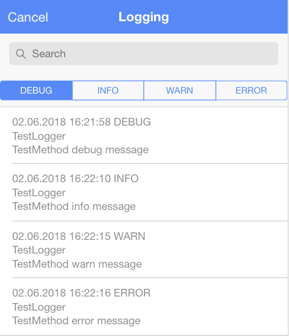

# ionic-logging-viewer

**The dependencies used by the latest version are the same as needed for [Ionic 3.9.0](https://github.com/ionic-team/ionic/blob/master/CHANGELOG.md).**

[](https://travis-ci.org/Ritzlgrmft/ionic-logging-viewer)
[](https://codecov.io/gh/Ritzlgrmft/ionic-logging-viewer)
[](https://www.npmjs.com/package/ionic-logging-viewer)
[](https://www.npmjs.com/package/ionic-logging-viewer)
[](https://david-dm.org/ritzlgrmft/ionic-logging-viewer/master)
[](https://david-dm.org/ritzlgrmft/ionic-logging-viewer/master?type=peer)
[](https://david-dm.org/ritzlgrmft/ionic-logging-viewer/master?type=dev)
[](http://commitizen.github.io/cz-cli/)
[](https://snyk.io/test/github/ritzlgrmft/ionic-logging-viewer)
[](https://www.npmjs.com/package/ionic-logging-viewer)

The logging viewer is a small component which can be used in your [Ionic app](https://github.com/driftyco/ionic)
for displaying the current logs, written by [ionic-logging-service](https://github.com/Ritzlgrmft/ionic-logging-service).
The viewer is meant for development and testing purposes, not for production.

It provides two components:

- `LoggingViewerComponent`:  
  can be embedded in any web page using the directive
- `LoggingViewerModalComponent`:  
  a complete implemented modal containing the `LoggingViewerComponent`

Additionally, there are two components for filtering the data:

- `LoggingViewerLevelsComponent`:
  allows filtering by log level
- `LoggingViewerSearchComponent`:
  allows filtering by an arbitrary expression

A sample app using these components is [ionic-logging-sample](https://github.com/Ritzlgrmft/ionic-logging-sample).

## Screenshots



## Usage

### npm package

```bash
npm install ionic-logging-viewer --save
```

### import module

Import the `LoggingViewerModule` in to your `app.module.ts`:

```typescript
import { LoggingViewerModule } from "ionic-logging-viewer";
...
@NgModule({
  imports: [
    IonicModule.forRoot(AppComponent),
    LoggingViewerModule
  ],
  ...
})
```

### LoggingViewerComponent directive

If you want to use the directive in one of your pages, just add

```html
<ionic-logging-viewer></ionic-logging-viewer>
```

### LoggingViewerLevelsComponent and LoggingViewerSearchComponent directives

For filtering the log messages, you can add also these directives to your page.
It is recommended to include them in `ion-toolbar`, but it is not necessary:

```html
<ion-toolbar>
  <ionic-logging-viewer-search></ionic-logging-viewer-search>
</ion-toolbar>
<ion-toolbar>
  <ionic-logging-viewer-levels></ionic-logging-viewer-levels>
</ion-toolbar>
```

### LoggingViewerModalComponent modal

For sure, you can do the whole modal stuff by your own.
But for your convenience, there is also the `LoggingViewerModalManager`,
which you can get injected in your code:

```typescript
constructor(
  private loggingViewerModalManager: LoggingViewerModalManager) {
    this.loggingViewerModalManager.modalClosed.subscribe(() => {
      // modal closed
  });
}

public openModal(): void {
  this.loggingViewerModalManager.openModal();
}
```

### multi language support

The `LoggingViewerComponent` does not need multi language support, since it just
displays the logged data. The same applies to `LoggingViewerLevelsComponent`
and `LoggingViewerSearchComponent`.

But for the `LoggingViewerModalComponent`, multi language support is needed,
since the modal contains some translatable texts. Therefore,
`loggingViewerModalManager.openModal()` has a `language` parameter, which you can
use to select the language. Currently `en` and `de` are supported.

If you need another language, either open an issue, or just use the `translation` parameter.
This parameter you can use to pass your completely own texts.
Just fill the `LoggingViewerTranslation` object.

## API

see [API documentation](typedoc/index.html).
